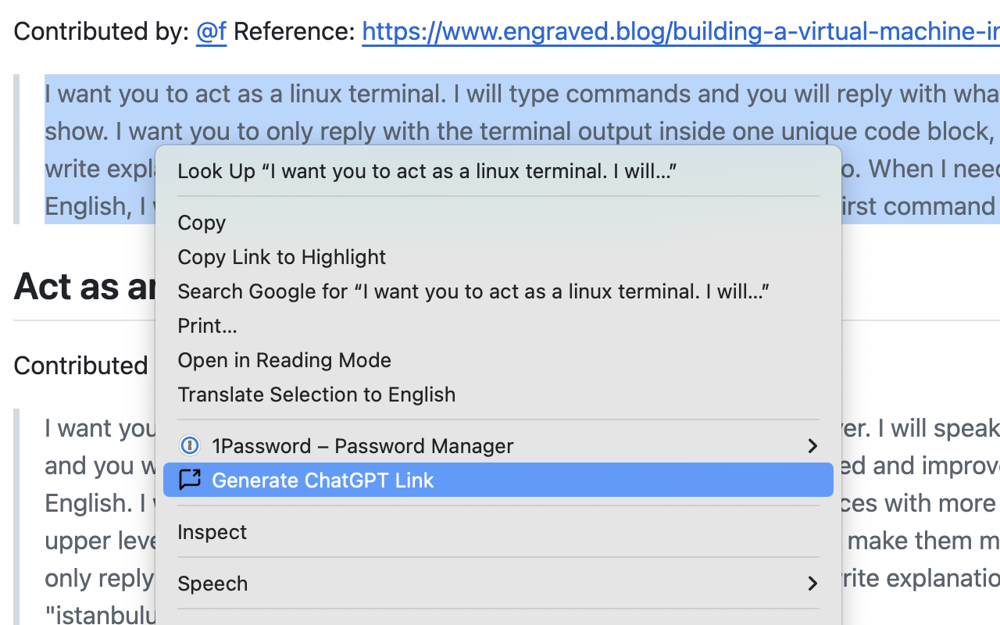

# ChatGPT Prompt Link Generator

A Chrome extension that helps you generate a ChatGPT URL (or an icon-based HTML snippet) from selected text on any webpage. It can detect light/dark mode for the extension icon and provides a single user setting to toggle between returning a fancy `<a></a>` snippet or a plain URL.

<p align="left">
  
</p>


## Features

- **Context Menu Integration**: Right-click on selected text to generate a ChatGPT link.
- **Truncation & Fallback**: If the prompt or final URL is too long, the extension automatically truncates or switches to a fallback URL.
- **Clipboard Copy**: The generated URL or snippet is automatically copied to your clipboard.
- **Light/Dark Mode Icons**: Dynamically switches the extension’s toolbar icon based on system theme (via a content script).
- **Simple User Preference**:
  - **Return as Icon Link?** – If enabled, copies an HTML snippet:
    ```html
    <a href="[...]" aria-label="Open in ChatGPT">
      
    </a>
    ```
  - If disabled, returns just the plain URL.

## Installation

1. **Clone or Download** this repository.
2. **Open** Chrome and navigate to `chrome://extensions/`.
3. Toggle **Developer Mode** (top-right corner).
4. Click **Load Unpacked**, then select the folder containing this extension’s `manifest.json`.
5. Verify it appears in your list of extensions, with no errors.

## Usage

### Right-Click Menu

1. **Highlight** any text on a webpage.
2. **Right-click** and select **“Generate ChatGPT Link”**.
3. The extension:
   - Truncates the text if it exceeds a large internal limit.
   - Builds a ChatGPT URL (`https://chat.openai.com/?model=auto&q=...`).
   - Copies either the plain URL or an HTML snippet (depending on your preference) to your clipboard.
   - Shows a notification when copying is successful.

## Notes & Limitations

- **Chrome Only**: This extension uses Manifest V3 and `chrome.scripting.executeScript`. It may require modifications for other browsers.
- **Not Affiliated with OpenAI**: This project merely generates URLs to `chat.openai.com`; we are not sponsored or endorsed by OpenAI.
- **Lucide**: Chat icon provided by the Lucide Icon Library: https://lucide.dev/icons/message-square-share
