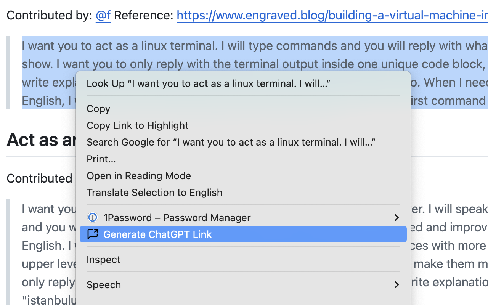

# ChatGPT Prompt Link Generator

A small Chrome extension that turns selected text into a shareable ChatGPT prompt URL. It can copy either the plain URL or a self-contained HTML icon link.

<p align="left">
  
</p>


## Features

- **One Context Menu Command**: Right-click selected text and choose **Generate ChatGPT Link**.
- **Direct ChatGPT Links**: Generates `https://chatgpt.com/?q=URL_ENCODED_PROMPT`.
- **Reliable Clipboard Copy**: Copies from an extension-owned offscreen document instead of injecting code into the current webpage.
- **Minimal Website Access**: Does not request permission to read or modify every webpage.
- **Clear Length Handling**: Warns instead of silently replacing or truncating prompts that produce overly long URLs.
- **Simple User Preference**:
  - **Copy as an icon link** – If enabled, copies a self-contained HTML snippet with an inline SVG:
    ```html
    <a href="[...]" aria-label="Open in ChatGPT" target="_blank" rel="noopener noreferrer">
      <svg aria-hidden="true">...</svg>
    </a>
    ```
  - If disabled (the default), returns just the plain URL.

## Installation

1. **Clone or Download** this repository.
2. **Open** Chrome and navigate to `chrome://extensions/`.
3. Toggle **Developer Mode** (top-right corner).
4. Click **Load Unpacked**, then select the folder containing this extension’s `manifest.json`.
5. Verify it appears in your list of extensions, with no errors.

## Usage

### Right-Click Menu

1. **Highlight** any text on a webpage.
2. **Right-click** and select **“Generate ChatGPT Link”**.
3. The extension:
   - Builds a ChatGPT URL (`https://chatgpt.com/?q=...`).
   - Copies either the plain URL or an HTML snippet (depending on your preference) to your clipboard.
   - Shows a notification when copying is successful.

### Output Preference

Click the extension's toolbar icon to switch between a plain URL and the self-contained icon link. You can also open **Extension options** from `chrome://extensions/`.

## Development

Run the link-generation tests with:

```sh
node --test tests/link-generator.test.js
```

Build a Chrome Web Store ZIP with:

```sh
./scripts/package-release.sh
```

See the [privacy policy](PRIVACY.md), [changelog](CHANGELOG.md), and [Chrome Web Store submission notes](docs/CHROME_WEB_STORE.md) before publishing.

## Notes & Limitations

- **Chrome 109 or Later**: The extension uses the Manifest V3 Offscreen API for clipboard access.
- **URL Length**: Prompts that create URLs longer than 8,000 characters are rejected with a notification.
- **Privacy**: Anyone with a generated link can read its prompt. The prompt may also appear in browser history, messaging previews, or system logs.
- **Undocumented URL Format**: ChatGPT's `?q=` parameter is not documented as a public API and may change without notice.
- **Not Affiliated with OpenAI**: This project merely generates URLs to `chatgpt.com`; we are not sponsored or endorsed by OpenAI.
- **Lucide**: Chat icon provided by the Lucide Icon Library: https://lucide.dev/icons/message-square-share
